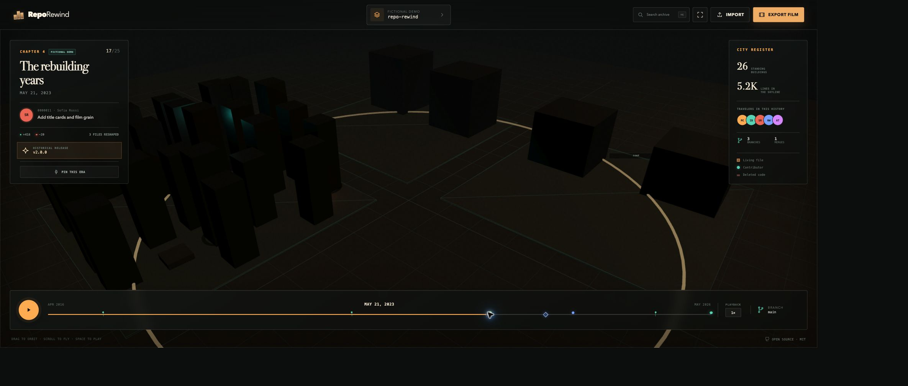
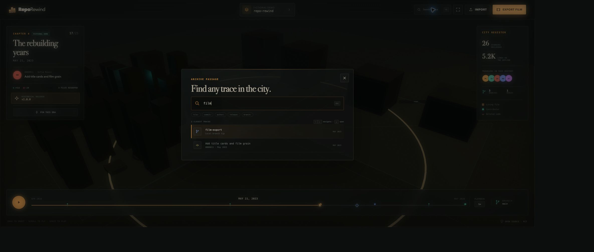
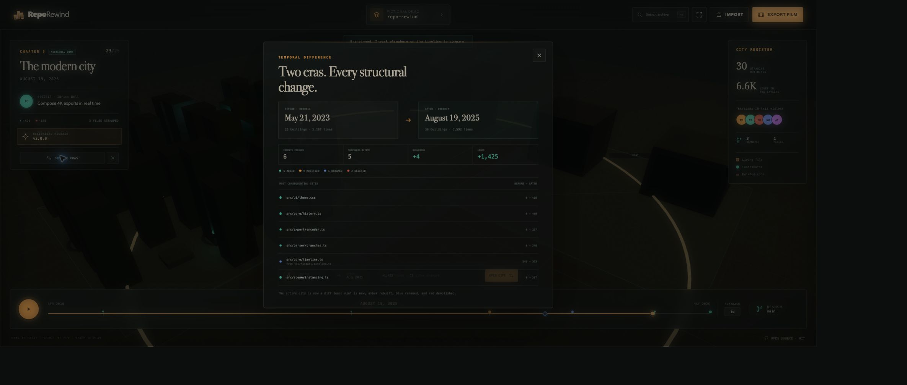
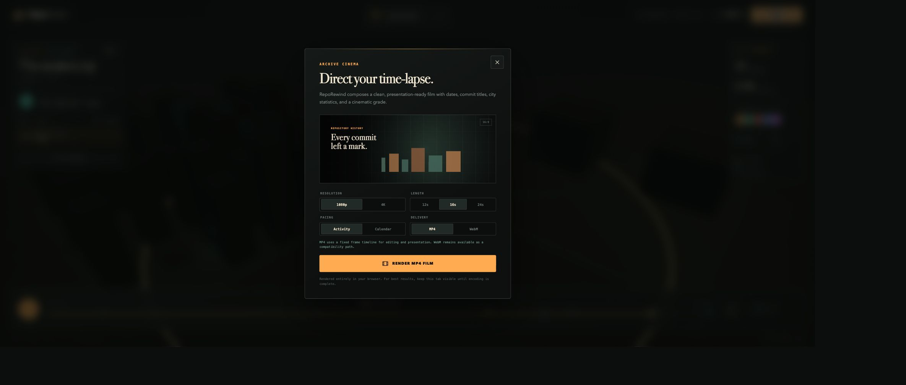
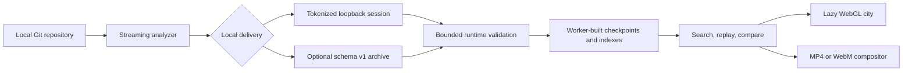

# RepoRewind

**Replay how your codebase became what it is—privately, from real Git evidence.**

[](./LICENSE)
[](./package.json)
[](./docs/privacy.md)
[](https://github.com/OthmaneBlial/RepoRewind/actions/workflows/ci.yml)
[](https://github.com/OthmaneBlial/RepoRewind/releases/latest)

**[Try the live city →](https://othmaneblial.github.io/RepoRewind/play/)** · **[Run it on my repository](#run-it-on-your-repository)** · [See the showcase](https://othmaneblial.github.io/RepoRewind/)

<picture>
  <source media="(prefers-reduced-motion: reduce)" srcset="./docs/screenshots/city-timeline.png">
  
</picture>

_A real 12-second export from RepoRewind's deterministic fictional archive. [Open the static frame](./docs/screenshots/city-timeline.png) or [control the replay yourself](https://othmaneblial.github.io/RepoRewind/play/)._

RepoRewind turns a local Git history into a living city you can replay, search, compare, and film. Files become buildings, folders become districts, contributors become travelers, releases become landmarks, refactors rebuild neighborhoods, and deleted code remains visible as ruins.

## Run it on your repository

Requirements: [Node.js](https://nodejs.org/) 24 (recommended) or Node.js 22.13+, npm 10+, and Git.

```bash
cd /path/to/your/repository
npx reporewind .
```

RepoRewind analyzes the checked-out branch, starts a read-only server on a random `127.0.0.1` port, opens the browser, and loads the real history automatically. Press <kbd>Ctrl C</kbd> in the terminal to stop it. Use `--no-open` to print the local URL without launching a browser.

Expected result:

```text
1,248 commits · 18 travelers · 9 releases
Local viewer: http://127.0.0.1:<random-port>/<private-session>/
Repository data stays on this machine. Press Ctrl+C to stop the viewer.
```

The first `npx` run contacts npm to download RepoRewind. Git analysis and viewing then stay on the machine: no environment variables, account, database, source upload, or application API is required. To explore without installing anything, open the [live fictional demo](https://othmaneblial.github.io/RepoRewind/play/).

## Three jobs worth returning for

| Onboard                                                                                     | Investigate                                                                                      | Present                                                                                        |
| ------------------------------------------------------------------------------------------- | ------------------------------------------------------------------------------------------------ | ---------------------------------------------------------------------------------------------- |
| Walk a new teammate through the eras, releases, migrations, and people behind the codebase. | Search a path or commit, pin an earlier era, and inspect the rename-aware evidence between eras. | Export a deterministic 12–24 second history film for a release retrospective, talk, or update. |

Every claim remains anchored to Git metadata. RepoRewind does not label code as good, bad, risky, or low quality.

## Product tour

| Replay the living city                                                                                                 | Find any trace                                                                                              |
| ---------------------------------------------------------------------------------------------------------------------- | ----------------------------------------------------------------------------------------------------------- |
|  |  |

| Compare two eras                                                                                       | Export a history film                                                                          |
| ------------------------------------------------------------------------------------------------------ | ---------------------------------------------------------------------------------------------- |
|  |  |

## Explore your own repository

Choose another ref or bound an exceptionally large history while keeping the same automatic viewer:

```bash
# Explore another local or remote ref
npx reporewind /path/to/repository --branch release/3.x

# Bound an exceptionally large history
npx reporewind /path/to/repository --max-commits 5000
```

The analyzer reads Git structure and numeric diffs—not file contents. Contributor email addresses are omitted unless `--include-emails` is explicitly supplied.

The checked-out branch is the default source of truth. RepoRewind follows first-parent history so every city frame represents a real state on that line of development; merges appear as confluence events rather than flattening incompatible histories together.

### Create a portable archive

Use the explicit `analyze` command when you need JSON for the hosted viewer or another tool:

```bash
npx reporewind analyze /path/to/repository --output ./reporewind-history.json

# Pipe clean JSON to another tool
npx reporewind analyze /path/to/repository --stdout > reporewind-history.json

# Explicitly replace an existing archive
npx reporewind analyze /path/to/repository --output ./reporewind-history.json --force
```

Then select **Import** in the [live viewer](https://othmaneblial.github.io/RepoRewind/play/) and choose `reporewind-history.json`. Run `npx reporewind --help` for every option. Contributors working from a source checkout can use the equivalent npm scripts:

```bash
npm ci
npm run dev
npm run analyze -- /path/to/repository --output ./reporewind-history.json
```

## What you can do

### Replay a truthful city

Scrub, play, pause, jump to releases/merges/branch tips, change playback speed, orbit the camera, or select a building. Stable path hashing keeps districts geographically consistent across time; a demolished site does not teleport when you rewind.

| Git evidence     | City grammar                                              |
| ---------------- | --------------------------------------------------------- |
| File             | A building whose height follows its current line count    |
| Top-level folder | A stable district separated by avenues                    |
| Contributor      | A colored traveler at their latest work site              |
| Commit           | Construction, demolition, or rebuilding signals           |
| Tag/release      | A historical ring and keyboard-accessible timeline marker |
| Rename/refactor  | A neighborhood rebuilding event                           |
| Deleted file     | A permanent, selectable ruin                              |

### Find any trace

Press <kbd>⌘K</kbd>, <kbd>Ctrl K</kbd>, or <kbd>/</kbd> to search files, commit messages and hashes, contributors, releases, or reachable branch tips. Narrow queries with `file:`, `commit:`, `author:`, `release:`, and `branch:`. Results move the timeline and open the relevant building when possible.

### Compare two eras

Choose **Pin this era**, travel elsewhere, and open the temporal diff. RepoRewind follows rename chains, reports line/building deltas, ranks consequential sites, and recolors the live city: mint for construction, amber for rebuilding, blue for renames, and red for demolition.

### Export a history film

Choose **Export film** for a fixed-timeline 1080p or 4K MP4/WebM time-lapse with dates, commit titles, statistics, merge/release cards, and a cinematic grade. Before rendering, the Share Safety review shows exactly which identifying fields will appear. The default **Public share** projection replaces the repository name and commit titles with generic labels, hides names, hashes, paths, refs, remotes, and emails, rounds dates to the month, and keeps only aggregate counts.

Visual frame selection, timestamps, event pacing, keyframe scheduling, and redaction copy are deterministic. Hardware encoders may produce different final bytes. Exports are cancelable and rendered entirely in the current browser tab. Each completed film downloads with a machine-readable privacy report containing the reviewed disclosure settings, included and omitted field names, archive scope and size, completeness, and schema/product versions—never omitted values.

## Privacy and security

RepoRewind has no hosted backend, analytics, telemetry, cookies, user accounts, or remote ingestion. The CLI is the only component that reads Git. The one-command viewer keeps its archive in process memory and serves it only through a tokenized loopback session; it writes no temporary history file. An explicit `reporewind analyze` command writes JSON only to the operator-selected path.

History archives can still contain sensitive names, paths, messages, and remotes. Review them before sharing. Share Safety changes only the exported presentation; it never mutates the canonical archive. Public overrides for sensitive fields and archives containing contributor emails require explicit confirmation. Runtime validation enforces a 256 MB file limit, bounded record counts and strings, valid relationships, and known change statuses before indexing untrusted input.

See [Privacy and trust boundaries](./docs/privacy.md) and the [Security policy](./SECURITY.md) for the full data inventory and reporting process.

## Architecture



- `cli/` streams NUL-delimited Git metadata with fixed argument arrays and emits the public schema.
- `src/core/` validates archives, builds roughly 64 checkpoints plus activity indexes, reconstructs frames through a bounded LRU cache, and computes rename-aware diffs.
- `src/workers/` prepares imported histories without blocking the main thread when workers are available.
- `src/components/CityScene.tsx` renders buildings, ruins, travelers, and event signals with instanced Three.js geometry.
- `src/export/` owns deterministic film scheduling, composition, capability probing, encoding, cancellation, and downloads.
- `src/data/` contains the fictional deterministic first-run archive.
- `schema/` contains the portable JSON Schema 2020-12 archive contract.

Read the complete [architecture guide](./docs/architecture.md), [video export decision](./docs/decisions/browser-video-export.md), [Three.js compatibility decision](./docs/decisions/three-compatibility.md), and [performance notes](./docs/performance.md).

## Development and validation

| Command                  | Purpose                                                           |
| ------------------------ | ----------------------------------------------------------------- |
| `npm run dev`            | Start the localhost-only Vite development server                  |
| `npm run test:watch`     | Run focused Vitest development loops                              |
| `npm run format`         | Apply the project Prettier configuration                          |
| `npm run lint`           | Run strict React, accessibility, import, and test lint rules      |
| `npm run typecheck`      | Validate TypeScript without emitting files                        |
| `npm run docs:check`     | Verify every local Markdown link target                           |
| `npm run licenses:check` | Verify locked browser dependencies have third-party notices       |
| `npm run test`           | Run core, Git, CLI, import/export, and frontend interaction tests |
| `npm run build`          | Build the static browser app and distributable CLI                |
| `npm run check`          | Run formatting, lint, docs/licenses, tests, type checking, builds |
| `npm run package:smoke`  | Install and exercise the exact packed CLI in a clean directory    |
| `npm run pages:build`    | Build and verify the canonical showcase plus interactive app      |
| `npm run verify`         | Run the full quality, Pages, package, and dependency audit gate   |

GitHub Actions is configured to run the quality gate on pinned Node.js 24 and exercise supported Node/OS combinations on Linux, macOS, and Windows. Dependency updates are grouped weekly.

See [Contributing](./CONTRIBUTING.md) for repository conventions and the [release checklist](./docs/release-checklist.md) for public evidence requirements.

## Production build and deployment

```bash
npm run build
npm run preview
```

The browser application, project license, and runtime notices are emitted to `dist/`; the CLI is emitted to `dist-cli/`. Preview binds to `http://127.0.0.1:4173` by default. Set `SOURCE_MAPS=true` only when a production debugging workflow explicitly requires source maps.

Deploy `dist/` to a static HTTPS host. `public/_headers` supplies a restrictive CSP, clickjacking protection, privacy-oriented browser permissions, and immutable asset caching on hosts that support Netlify-style header files. Configure equivalent headers on other hosts.

Docker is intentionally not included: the web output is static, while the analyzer needs direct access to the operator's local Git repository. A container would add mounts and permission friction without improving isolation or deployment of the actual product. Any standard static server can host `dist/`.

## Compatibility and limits

- Node.js 24 is pinned for development; Node.js 22.13+ is supported. EOL Node releases are excluded.
- The CLI is designed for current Git on Linux, macOS, and Windows; CI is configured to exercise all three.
- The web app targets ES2022 and requires a current desktop browser with modules, Web Workers, Canvas, and WebGL. Search/import validation can still report useful errors if WebGL initialization fails.
- MP4 requires HTTPS/localhost and H.264 WebCodecs support. WebM depends on MediaRecorder codec support.
- The 3D city chunk is lazy-loaded but remains the largest asset (about 896.6 kB minified / 238.6 kB gzip in the recorded production build).
- Imported archives are intentionally memory-only; there is no cross-session library.
- Safety limits are 256 MB, 250,000 commits, and 2,000,000 file-change entries. Use `--max-commits` well before those ceilings on ordinary laptops.
- The selected branch's first-parent path is the canonical film; side branches appear through refs, tips, and merge events rather than as parallel simulated timelines.

For common failures and recovery steps, see [Troubleshooting](./docs/troubleshooting.md).

## Roadmap

The product stays centered on one exceptional local-first workflow: analyze → explore → understand → review → export. See the [product and adoption roadmap](./ROADMAP.md) for the evidence-backed path from the `v0.2.0` activation release to privacy-safe story packs and repeatable archaeology workflows.

## Project information

- Changes: [CHANGELOG.md](./CHANGELOG.md)
- Contributing: [CONTRIBUTING.md](./CONTRIBUTING.md)
- Code of Conduct: [CODE_OF_CONDUCT.md](./CODE_OF_CONDUCT.md)
- Security: [SECURITY.md](./SECURITY.md)
- Third-party notices: [THIRD_PARTY_NOTICES.md](./THIRD_PARTY_NOTICES.md)
- License: [MIT](./LICENSE)
