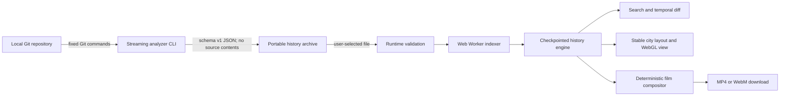

# Architecture

RepoRewind is deliberately split into a local Git analyzer and a static browser application. There is no application server or hosted data plane.

## Analyzer boundary

`cli/git-reader.ts` uses `execFile`, argument arrays, `--end-of-options`, validated refs, and NUL-delimited Git output. It reads commit metadata, names/statuses, numeric diffs, refs, and tags. It never reads file contents into the archive. The selected branch is replayed in first-parent order so each frame is a state that existed on that line of history.

The CLI emits the public contract in `schema/reporewind-history.schema.json`. Runtime validation in `src/core/history.ts` is the security boundary used by the browser; TypeScript interfaces alone are not trusted.

## Browser boundary

`src/core/prepare-history.ts` caps files at 256 MB, validates all records, and delegates parsing/index construction to a module worker where available. The archive and its indexes remain in memory and disappear on reload.

`HistoryEngine` stores roughly 64 replay checkpoints and a 24-frame LRU snapshot cache. Requests restore the closest prior checkpoint and replay only the bounded remainder. `src/core/layout.ts` derives stable coordinates from the complete path set, so scrubbing does not rearrange districts.

`src/core/search.ts` operates over prepared indexes. `src/core/compare.ts` computes rename-aware differences between two real snapshots. Neither subsystem performs network access.

## Rendering and export

`src/components/CityScene.tsx` is lazy-loaded so the application shell and import/search logic are available before the Three.js renderer. Repeated buildings, ruins, travelers, and event signals use instanced geometry. A reduced-motion preference suppresses nonessential pulses and camera motion.

`src/export/timelapse.ts` renders a fixed frame schedule. MP4 uses MediaBunny and a runtime H.264 capability probe; WebM uses MediaRecorder as an explicit fallback. Frame selection and timestamps are deterministic, but hardware encoders are not expected to produce byte-identical files. See the [browser video export decision](./decisions/browser-video-export.md).

## Extension points

- Additive archive fields require coordinated type, runtime-validator, schema, fixture, and compatibility updates.
- New visual encodings belong in `CityScene` only when they correspond to real archive evidence.
- New searchable entities should extend the prepared index rather than scanning every commit per keystroke.
- Longer/larger film presets must move away from in-memory output before increasing current bounds.
